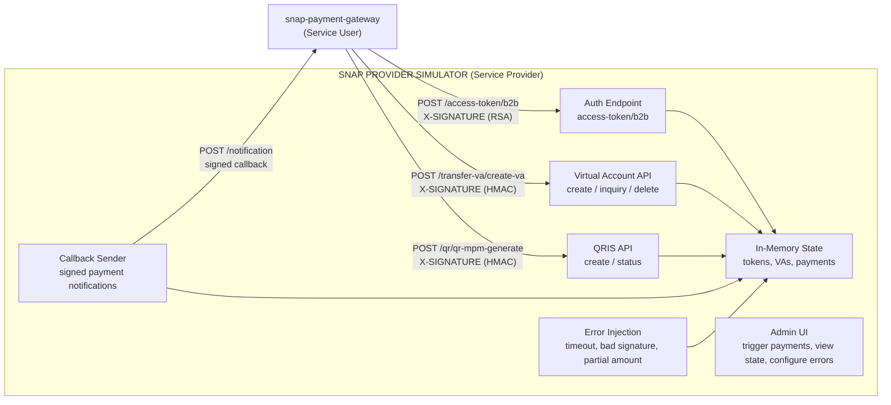

# SNAP Provider Simulator

> **Status (2026-10-06):** design below predates the decision to emulate **BRI's publicly documented SNAP Virtual Account behaviour** (BRIVA and BRIVA Online). Paths and payloads will follow BRI's public documentation; see `CLAUDE.md`. This project is not affiliated with or endorsed by PT Bank Rakyat Indonesia (Persero) Tbk.

Local SNAP Service Provider (SP) simulator for testing [snap-payment-gateway](https://github.com/artivisi/snap-payment-gateway) without connecting to real bank sandboxes.

## What This Solves

Bank sandboxes are slow, rate-limited, occasionally down, and don't let you inject error scenarios. This simulator runs locally, responds instantly, and gives full control over every response — including failures.

It implements the bank side of the [SNAP API standard](https://www.bi.go.id/en/layanan/standar/snap/default.aspx): receives API calls from a Service User (the payment gateway), verifies signatures, manages state, and sends callbacks.

## Architecture



## Core Features

### 1. SNAP Authentication

- Accepts `POST /access-token/b2b` with asymmetric signature verification (SHA256withRSA)
- Validates `X-SIGNATURE`, `X-TIMESTAMP`, `X-CLIENT-KEY` headers
- Issues access tokens with configurable TTL
- Rejects expired tokens on subsequent API calls

### 2. Virtual Account Lifecycle

- `POST /transfer-va/create-va` — create VA, store in memory
- `POST /transfer-va/inquiry-va` — query VA status
- `POST /transfer-va/delete-va` — delete/expire VA
- State transitions: CREATED → PAID → SETTLED (or EXPIRED)

### 3. QRIS (MPM)

- `POST /qr/qr-mpm-generate` — generate QR code data
- `POST /qr/qr-mpm-query` — query payment status

### 4. Callback Sender

After a simulated payment, sends a signed callback to the gateway's notification endpoint:

- Generates symmetric signature (HMAC-SHA512) on the callback body
- Respects the SNAP callback format and headers
- Configurable delay between payment and callback (simulate real-world latency)

### 5. Error Injection

Expose admin endpoints to force specific error scenarios:

```
POST /admin/errors/next-response
{
  "type": "TIMEOUT",           // hang for N seconds then respond
  "duration_ms": 30000
}

POST /admin/errors/next-response
{
  "type": "INVALID_SIGNATURE"  // return valid response but with bad signature
}

POST /admin/errors/next-response
{
  "type": "DUPLICATE_CALLBACK" // send the same callback twice
}

POST /admin/errors/next-response
{
  "type": "PARTIAL_AMOUNT",    // callback with different amount than VA
  "amount": 4500000
}

POST /admin/errors/next-response
{
  "type": "HTTP_ERROR",        // return 500/502/503
  "status_code": 502
}
```

### 6. Admin UI

Web interface to:
- View all created VAs and their current state
- Trigger payment on a specific VA (simulates customer paying)
- View token issuance history
- View callback delivery log (sent, acknowledged, failed)
- Configure global error injection rules
- Reset all state

### 7. Auto-Pay Mode

Optional mode where the simulator automatically "pays" any created VA after a configurable delay. For automated test suites that need the full create → pay → callback flow without manual intervention.

```yaml
# application.yml
simulator:
  auto-pay:
    enabled: true
    delay-ms: 3000          # pay 3 seconds after VA creation
  callback:
    delay-ms: 1000          # send callback 1 second after payment
    target-url: http://snap-payment-gateway:8080/api/v1/notifications
```

## API Compatibility

The simulator exposes the same SNAP API endpoints as real banks. The payment gateway doesn't know (or care) whether it's talking to BNI's sandbox or this simulator — same URLs, same headers, same signature verification.

| SNAP Endpoint | Method | Description |
|---|---|---|
| `/v1.0/access-token/b2b` | POST | Issue access token (asymmetric signature) |
| `/v1.0/transfer-va/create-va` | POST | Create virtual account |
| `/v1.0/transfer-va/inquiry-va` | POST | Query VA status |
| `/v1.0/transfer-va/delete-va` | POST | Delete VA |
| `/v1.0/qr/qr-mpm-generate` | POST | Generate QRIS MPM |
| `/v1.0/qr/qr-mpm-query` | POST | Query QRIS payment status |

Admin endpoints (non-SNAP, for test control):

| Endpoint | Method | Description |
|---|---|---|
| `/admin/payments/{va_number}/pay` | POST | Simulate customer payment on VA |
| `/admin/state` | GET | Dump all simulator state |
| `/admin/state` | DELETE | Reset all state |
| `/admin/errors/next-response` | POST | Inject error for next API call |
| `/admin/errors` | GET | List active error injection rules |
| `/admin/errors` | DELETE | Clear all error rules |
| `/admin/callbacks` | GET | View callback delivery log |

## Tech Stack

| Layer | Technology | Version |
|---|---|---|
| Language | Java | 25 |
| Framework | Spring Boot | 4 |
| Build | Maven | 3.9+ |
| Security | Bouncy Castle (signature verification) | latest |
| Frontend | Thymeleaf + Tailwind CSS + HTMX | latest |
| Container | Docker | latest |
| State | In-memory (ConcurrentHashMap) — no database needed |  |

No database. All state is in-memory and resets on restart. This is a test tool, not a production system.

## Project Structure

```
snap-provider-simulator/
├── docker-compose.yml
├── src/
│   ├── main/java/.../
│   │   ├── auth/                  # Access token endpoint, RSA signature verification
│   │   ├── va/                    # Virtual Account SNAP endpoints
│   │   ├── qris/                  # QRIS SNAP endpoints
│   │   ├── callback/              # Callback sender (signs and posts to gateway)
│   │   ├── state/                 # In-memory state store
│   │   ├── error/                 # Error injection engine
│   │   ├── admin/                 # Admin API + UI controllers
│   │   └── snap/
│   │       ├── signature/         # Asymmetric + symmetric signature verify/generate
│   │       └── dto/               # SNAP request/response DTOs
│   └── main/resources/
│       └── templates/             # Admin UI (Thymeleaf)
├── pom.xml
└── docs/
    └── error-scenarios.md         # Catalog of testable error scenarios
```

## Quick Start

```bash
git clone https://github.com/artivisi/snap-provider-simulator.git
cd snap-provider-simulator
docker compose up
```

Access:

| Component | URL |
|---|---|
| SNAP API (bank endpoints) | http://localhost:9090/v1.0 |
| Admin UI | http://localhost:9090/admin |

### With snap-payment-gateway

```yaml
# snap-payment-gateway/docker-compose.yml
services:
  gateway:
    # ... gateway config ...
    environment:
      BANK_BNI_BASE_URL: http://sp-simulator:9090
      BANK_BCA_BASE_URL: http://sp-simulator:9090

  sp-simulator:
    image: artivisi/snap-provider-simulator
    ports:
      - "9090:9090"
    environment:
      SIMULATOR_CALLBACK_TARGET_URL: http://gateway:8080/api/v1/notifications
      SIMULATOR_AUTO_PAY_ENABLED: "true"
      SIMULATOR_AUTO_PAY_DELAY_MS: "3000"
```

The gateway points all bank URLs to the simulator. The simulator sends callbacks back to the gateway. Full loop, no external dependencies.

## Credential Setup

Generate a test RSA key pair:

```bash
# Generate private key
openssl genrsa -out test-private.pem 2048

# Extract public key
openssl rsa -in test-private.pem -pubout -out test-public.pem
```

Configure the simulator to accept this key:

```yaml
# application.yml
simulator:
  clients:
    - client-id: "GATEWAY-TEST-001"
      client-secret: "test-secret-for-hmac-signing"
      public-key-path: "classpath:keys/test-public.pem"
```

Configure the gateway to use the corresponding private key when calling the simulator.

## Relationship to Other Projects

| Project | Role |
|---|---|
| [payment-gateway](https://github.com/artivisi/payment-gateway) | The self-hosted VA gateway this simulator tests. |
| SNAP integration training labs | Hands-on SNAP training; drives the bank-as-caller, inquiry-status and statement-export features. |
| [payment-simulator](https://github.com/artivisi/payment-simulator) | Simulates the bank-internal layer (ISO 8583, switching, HSM) underneath SNAP. Different abstraction level. |

## YouTube Series

This simulator is built as part of the payment gateway YouTube series. It appears first (before real bank sandboxes) so viewers can follow along without bank credentials.

## License

Apache License 2.0
